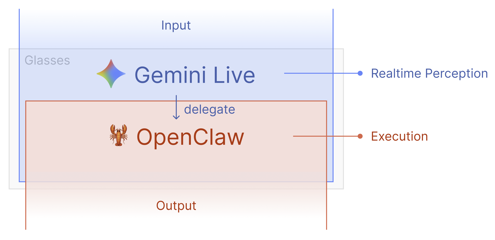
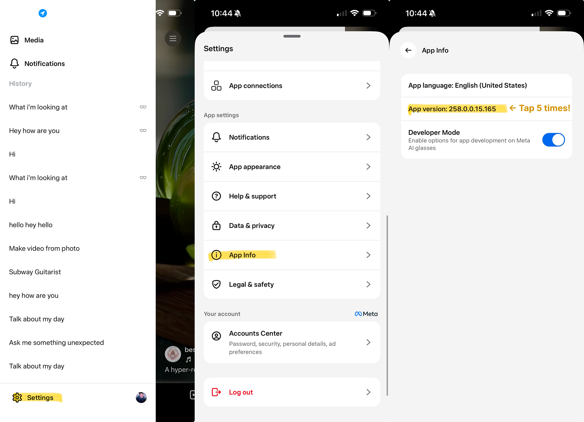

# VisionClaw


A real-time AI assistant for Meta Ray-Ban smart glasses. See what you see, hear what you say, and take actions on your behalf -- all through voice.


Built on [Meta Wearables DAT SDK](https://github.com/facebook/meta-wearables-dat-ios) (iOS) / [DAT Android SDK](https://github.com/nichochar/openclaw) (Android) + [Gemini Live API](https://ai.google.dev/gemini-api/docs/live) + [OpenClaw](https://github.com/nichochar/openclaw) (optional).

**Supported platforms:** iOS (iPhone) and Android (Pixel, Samsung, etc.)

## What It Does

Put on your glasses, tap the AI button, and talk:

- **"What am I looking at?"** -- Gemini sees through your glasses camera and describes the scene
- **"Add milk to my shopping list"** -- delegates to OpenClaw, which adds it via your connected apps
- **"Send a message to John saying I'll be late"** -- routes through OpenClaw to WhatsApp/Telegram/iMessage
- **"Search for the best coffee shops nearby"** -- web search via OpenClaw, results spoken back

The glasses camera streams at ~1fps to Gemini for visual context, while audio flows bidirectionally in real-time.

## How It Works



```
Meta Ray-Ban Glasses (or phone camera)
       |
       | video frames + mic audio
       v
iOS / Android App (this project)
       |
       | JPEG frames (~1fps) + PCM audio (16kHz)
       v
Gemini Live API (WebSocket)
       |
       |-- Audio response (PCM 24kHz) --> App --> Speaker
       |-- Tool calls (execute) -------> App --> OpenClaw Gateway
       |                                              |
       |                                              v
       |                                      56+ skills: web search,
       |                                      messaging, smart home,
       |                                      notes, reminders, etc.
       |                                              |
       |<---- Tool response (text) <----- App <-------+
       |
       v
  Gemini speaks the result
```

**Key pieces:**
- **Gemini Live** -- real-time voice + vision AI over WebSocket (native audio, not STT-first)
- **OpenClaw** (optional) -- local gateway that gives Gemini access to 56+ tools and all your connected apps
- **Phone mode** -- test the full pipeline using your phone camera instead of glasses
- **WebRTC streaming** -- share your glasses POV live to a browser viewer

---

## Quick Start (iOS)

### 1. Clone and open

```bash
git clone https://github.com/sseanliu/VisionClaw.git
cd VisionClaw/samples/CameraAccess
open CameraAccess.xcodeproj
```

### 2. Add your secrets

Copy the example file and fill in your values:

```bash
cp CameraAccess/Secrets.swift.example CameraAccess/Secrets.swift
```

Edit `Secrets.swift` with your [Gemini API key](https://aistudio.google.com/apikey) (required) and optional OpenClaw/WebRTC config.

### 3. Build and run

Select your iPhone as the target device and hit Run (Cmd+R).

### 4. Try it out

**Without glasses (iPhone mode):**
1. Tap **"Start on iPhone"** -- uses your iPhone's back camera
2. Tap the **AI button** to start a Gemini Live session
3. Talk to the AI -- it can see through your iPhone camera

**With Meta Ray-Ban glasses:**

First, enable Developer Mode in the Meta AI app:

1. Open the **Meta AI** app on your iPhone
2. Go to **Settings** (gear icon, bottom left)
3. Tap **App Info**
4. Tap the **App version** number **5 times** -- this unlocks Developer Mode
5. Go back to Settings -- you'll now see a **Developer Mode** toggle. Turn it on.



Then in VisionClaw:
1. Tap **"Start Streaming"** in the app
2. Tap the **AI button** for voice + vision conversation

---

## Quick Start (Android)

### 1. Clone and open

```bash
git clone https://github.com/sseanliu/VisionClaw.git
```

Open `samples/CameraAccessAndroid/` in Android Studio.

### 2. Configure GitHub Packages (DAT SDK)

The Meta DAT Android SDK is distributed via GitHub Packages. You need a GitHub Personal Access Token with `read:packages` scope.

1. Go to [GitHub > Settings > Developer Settings > Personal Access Tokens](https://github.com/settings/tokens) and create a token with `read:packages` scope
2. In `samples/CameraAccessAndroid/local.properties`, add:

```properties
gpr.user=YOUR_GITHUB_USERNAME
gpr.token=YOUR_GITHUB_TOKEN
```

> **Tip:** If you have the `gh` CLI installed, you can run `gh auth token` to get a valid token. Make sure it has `read:packages` scope -- if not, run `gh auth refresh -s read:packages`.

### 3. Add your secrets

```bash
cd samples/CameraAccessAndroid/app/src/main/java/com/meta/wearable/dat/externalsampleapps/cameraaccess/
cp Secrets.kt.example Secrets.kt
```

Edit `Secrets.kt` with your [Gemini API key](https://aistudio.google.com/apikey) (required) and optional OpenClaw/WebRTC config.

### 4. Build and run

1. Let Gradle sync in Android Studio (it will download the DAT SDK from GitHub Packages)
2. Select your Android phone as the target device
3. Click Run (Shift+F10)

> **Wireless debugging:** You can also install via ADB wirelessly. Enable **Wireless debugging** in your phone's Developer Options, then pair with `adb pair <ip>:<port>`.

### 5. Try it out

**Without glasses (Phone mode):**
1. Tap **"Start on Phone"** -- uses your phone's back camera
2. Tap the **AI button** (sparkle icon) to start a Gemini Live session
3. Talk to the AI -- it can see through your phone camera

**With Meta Ray-Ban glasses:**

Enable Developer Mode in the Meta AI app (same steps as iOS above), then:
1. Tap **"Start Streaming"** in the app
2. Tap the **AI button** for voice + vision conversation

---

## Setup: OpenClaw (Optional)

OpenClaw gives Gemini the ability to take real-world actions: send messages, search the web, manage lists, control smart home devices, and more. Without it, Gemini is voice + vision only.

### 1. Install and configure OpenClaw

Follow the [OpenClaw setup guide](https://github.com/nichochar/openclaw). Make sure the gateway is enabled:

In `~/.openclaw/openclaw.json`:

```json
{
  "gateway": {
    "port": 18789,
    "bind": "lan",
    "auth": {
      "mode": "token",
      "token": "your-gateway-token-here"
    },
    "http": {
      "endpoints": {
        "chatCompletions": { "enabled": true }
      }
    }
  }
}
```

Key settings:
- `bind: "lan"` -- exposes the gateway on your local network so your phone can reach it
- `chatCompletions.enabled: true` -- enables the `/v1/chat/completions` endpoint (off by default)
- `auth.token` -- the token your app will use to authenticate

### 2. Configure the app

**iOS** -- In `Secrets.swift`:
```swift
static let openClawHost = "http://Your-Mac.local"
static let openClawPort = 18789
static let openClawGatewayToken = "your-gateway-token-here"
```

**Android** -- In `Secrets.kt`:
```kotlin
const val openClawHost = "http://Your-Mac.local"
const val openClawPort = 18789
const val openClawGatewayToken = "your-gateway-token-here"
```

To find your Mac's Bonjour hostname: **System Settings > General > Sharing** -- it's shown at the top (e.g., `Johns-MacBook-Pro.local`).

> Both iOS and Android also have an in-app Settings screen where you can change these values at runtime without editing source code.

### 3. Start the gateway

```bash
openclaw gateway restart
```

Verify it's running:

```bash
curl http://localhost:18789/health
```

Now when you talk to the AI, it can execute tasks through OpenClaw.

---

## Architecture

### Key Files (iOS)

All source code is in `samples/CameraAccess/CameraAccess/`:

| File | Purpose |
|------|---------|
| `Gemini/GeminiConfig.swift` | API keys, model config, system prompt |
| `Gemini/GeminiLiveService.swift` | WebSocket client for Gemini Live API |
| `Gemini/AudioManager.swift` | Mic capture (PCM 16kHz) + audio playback (PCM 24kHz) |
| `Gemini/GeminiSessionViewModel.swift` | Session lifecycle, tool call wiring, transcript state |
| `OpenClaw/ToolCallModels.swift` | Tool declarations, data types |
| `OpenClaw/OpenClawBridge.swift` | HTTP client for OpenClaw gateway |
| `OpenClaw/ToolCallRouter.swift` | Routes Gemini tool calls to OpenClaw |
| `iPhone/IPhoneCameraManager.swift` | AVCaptureSession wrapper for iPhone camera mode |
| `WebRTC/WebRTCClient.swift` | WebRTC peer connection + SDP negotiation |
| `WebRTC/SignalingClient.swift` | WebSocket signaling for WebRTC rooms |

### Key Files (Android)

All source code is in `samples/CameraAccessAndroid/app/src/main/java/.../cameraaccess/`:

| File | Purpose |
|------|---------|
| `gemini/GeminiConfig.kt` | API keys, model config, system prompt |
| `gemini/GeminiLiveService.kt` | OkHttp WebSocket client for Gemini Live API |
| `gemini/AudioManager.kt` | AudioRecord (16kHz) + AudioTrack (24kHz) |
| `gemini/GeminiSessionViewModel.kt` | Session lifecycle, tool call wiring, UI state |
| `openclaw/ToolCallModels.kt` | Tool declarations, data classes |
| `openclaw/OpenClawBridge.kt` | OkHttp HTTP client for OpenClaw gateway |
| `openclaw/ToolCallRouter.kt` | Routes Gemini tool calls to OpenClaw |
| `phone/PhoneCameraManager.kt` | CameraX wrapper for phone camera mode |
| `webrtc/WebRTCClient.kt` | WebRTC peer connection (stream-webrtc-android) |
| `webrtc/SignalingClient.kt` | OkHttp WebSocket signaling for WebRTC rooms |
| `settings/SettingsManager.kt` | SharedPreferences with Secrets.kt fallback |

### Audio Pipeline

- **Input**: Phone mic -> AudioManager (PCM Int16, 16kHz mono, 100ms chunks) -> Gemini WebSocket
- **Output**: Gemini WebSocket -> AudioManager playback queue -> Phone speaker
- **iOS iPhone mode**: Uses `.voiceChat` audio session for echo cancellation + mic gating during AI speech
- **iOS Glasses mode**: Uses `.videoChat` audio session (mic is on glasses, speaker is on phone -- no echo)
- **Android**: Uses `VOICE_COMMUNICATION` audio source for built-in acoustic echo cancellation

### Video Pipeline

- **Glasses**: DAT SDK video stream (24fps) -> throttle to ~1fps -> JPEG (50% quality) -> Gemini
- **Phone**: Camera capture (30fps) -> throttle to ~1fps -> JPEG -> Gemini

### Tool Calling

Gemini Live supports function calling. Both apps declare a single `execute` tool that routes everything through OpenClaw:

1. User says "Add eggs to my shopping list"
2. Gemini speaks "Sure, adding that now" (verbal acknowledgment before tool call)
3. Gemini sends `toolCall` with `execute(task: "Add eggs to the shopping list")`
4. `ToolCallRouter` sends HTTP POST to OpenClaw gateway
5. OpenClaw executes the task using its 56+ connected skills
6. Result returns to Gemini via `toolResponse`
7. Gemini speaks the confirmation

---

## Requirements

### iOS
- iOS 17.0+
- Xcode 15.0+
- Gemini API key ([get one free](https://aistudio.google.com/apikey))
- Meta Ray-Ban glasses (optional -- use iPhone mode for testing)
- OpenClaw on your Mac (optional -- for agentic actions)

### Android
- Android 14+ (API 34+)
- Android Studio Ladybug or newer
- GitHub account with `read:packages` token (for DAT SDK)
- Gemini API key ([get one free](https://aistudio.google.com/apikey))
- Meta Ray-Ban glasses (optional -- use Phone mode for testing)
- OpenClaw on your Mac (optional -- for agentic actions)

---

## Troubleshooting

### General

**Gemini doesn't hear me** -- Check that microphone permission is granted. The app uses aggressive voice activity detection -- speak clearly and at normal volume.

**OpenClaw connection timeout** -- Make sure your phone and Mac are on the same Wi-Fi network, the gateway is running (`openclaw gateway restart`), and the hostname matches your Mac's Bonjour name.

**OpenClaw opens duplicate browser tabs** -- This is a known upstream issue in OpenClaw's CDP (Chrome DevTools Protocol) connection management ([#13851](https://github.com/nichochar/openclaw/issues/13851), [#12317](https://github.com/nichochar/openclaw/issues/12317)). Using `profile: "openclaw"` (managed Chrome) instead of the default extension relay may improve stability.

### iOS-specific

**"Gemini API key not configured"** -- Add your API key in Secrets.swift or in the in-app Settings.

**Echo/feedback in iPhone mode** -- The app mutes the mic while the AI is speaking. If you still hear echo, try turning down the volume.

### Android-specific

**Gradle sync fails with 401 Unauthorized** -- Your GitHub token is missing or doesn't have `read:packages` scope. Check `local.properties` for `gpr.user` and `gpr.token`. Generate a new token at [github.com/settings/tokens](https://github.com/settings/tokens).

**Gemini WebSocket times out** -- The Gemini Live API sends binary WebSocket frames. If you're building a custom client, make sure to handle both text and binary frame types.

**Audio not working** -- Ensure `RECORD_AUDIO` permission is granted. On Android 13+, you may need to grant this permission manually in Settings > Apps.

**Phone camera not starting** -- Ensure `CAMERA` permission is granted. CameraX requires both the permission and a valid lifecycle.

For DAT SDK issues, see the [developer documentation](https://wearables.developer.meta.com/docs/develop/) or the [discussions forum](https://github.com/facebook/meta-wearables-dat-ios/discussions).

## License

This source code is licensed under the license found in the [LICENSE](LICENSE) file in the root directory of this source tree.
